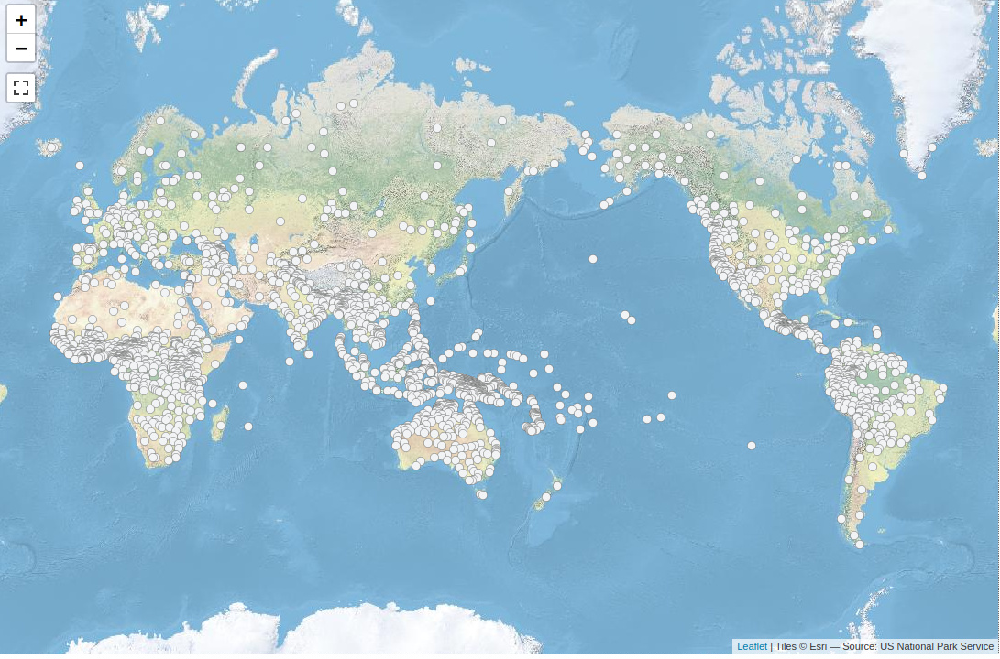
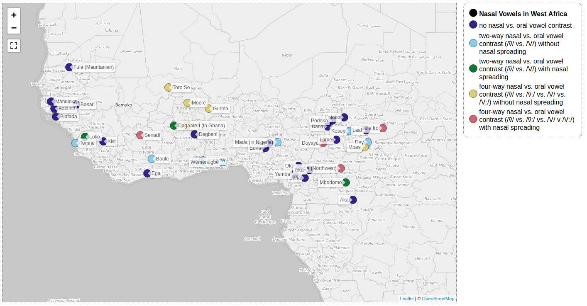
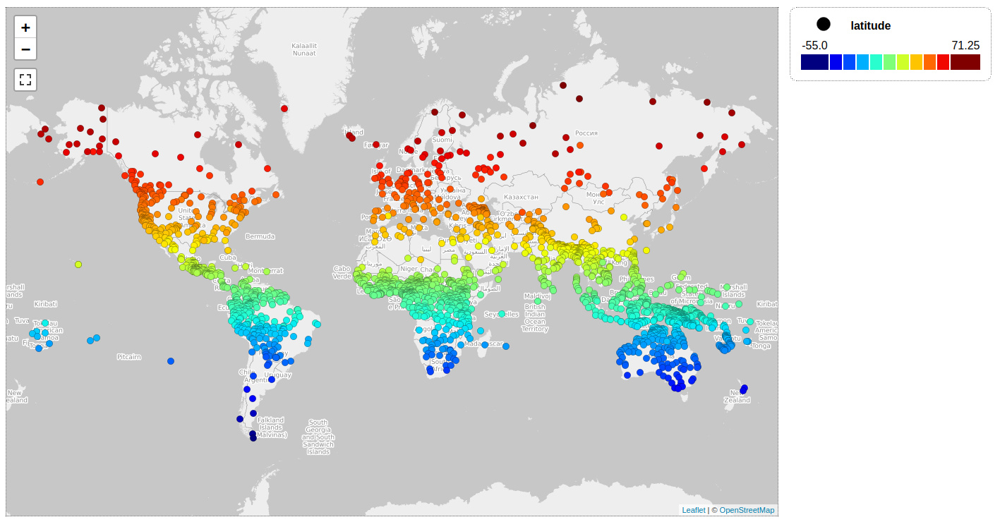
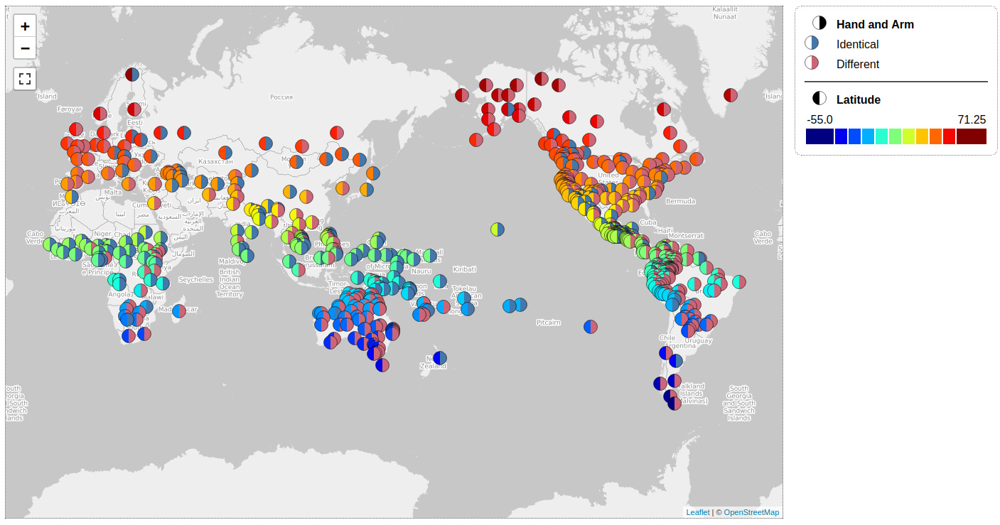
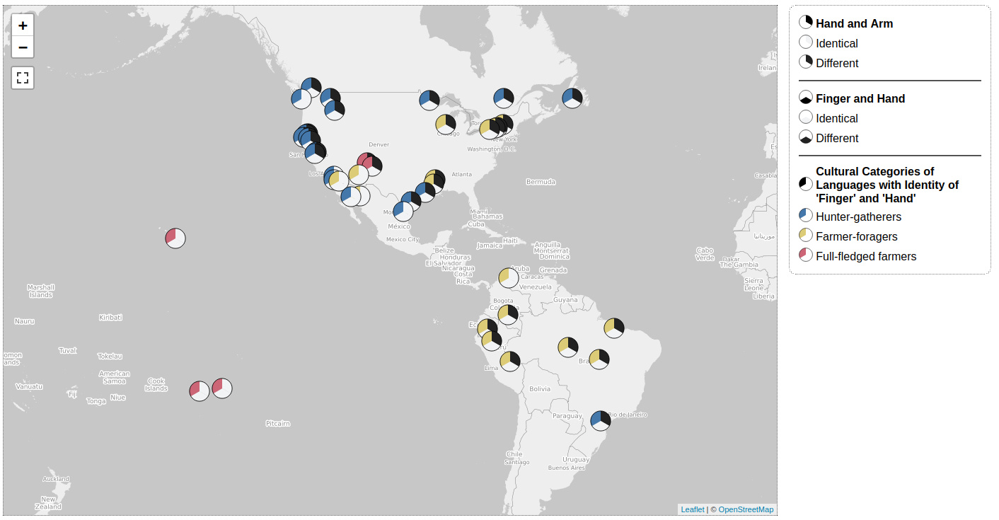
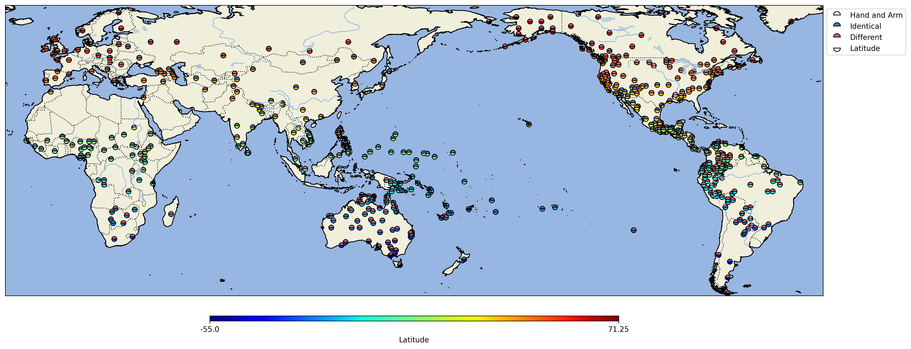
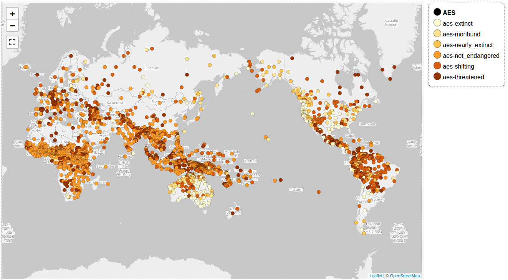

# cldfviz

[](https://github.com/cldf/cldfviz/actions?query=workflow%3Atests)
[](https://pypi.org/project/cldfviz)

Python library providing tools to visualize [CLDF](https://cldf.clld.org) datasets.


## Install

Run
```shell
pip install cldfviz
```
If you want create maps in image formats (PNG, JPG, PDF), the `cartopy` package is needed,
which will be installed with
```shell
pip install cldfviz[cartopy]
```
Note: Since `cartopy` has quite a few system-level requirements, installation may be somewhat tricky. Should
problems arise, https://scitools.org.uk/cartopy/docs/v0.15/installing.html may help.


## CLI

`cldfviz` is implemented as [`cldfbench`](https://github.com/cldf/cldfbench)
plugin, i.e. it provides subcommands for the `cldfbench` command.

After installation you should see subcommands with a `cldfviz.` prefix
listed when running
```shell
cldfbench -h
```


### `cldfviz.map`

A common way to visualize data from a CLDF StructureDataset is as "dots on a map",
i.e. as [WALS](https://wals.info)-like geographic maps.

This can be done using the `cldfviz.map` command. If you need to look up geo-coordinates
for languages in Glottolog (because the dataset you are interested in does not provide coordinates,
but has Glottocodes), this command needs 
- access to a local clone or export of the [glottolog/glottolog](https://github.com/glottolog/glottolog)
repository,
- Glottocodes for all languages in the set, either given as [`languageReference`](https://cldf.clld.org/v1.0/terms.rdf#languageReference)
  in the `ValueTable` or as [`glottocode`](https://cldf.clld.org/v1.0/terms.rdf#glottocode) in `LanguageTable`.
  
We'll explain the usage of the command by using it with the [WALS CLDF data](https://github.com/cldf-datasets/wals/releases/tag/v2020.1).
(Run `cldfbench cldfviz.map -h` to list all options of the command.)

Running
```shell
cldfbench cldfviz.map wals-2020.1/cldf/StructureDataset-metadata.json --base-layer Esri_WorldPhysical --pacific-centered
```
will create an HTML page `map.html` and open it in the browser, thus rendering an interactive [leaflet](https://leafletjs.com/)
map of the languages in the dataset.



For smaller language samples, it may be suitable to display the language names on the map, too. 
Here's [WALS' feature 10B](https://wals.info/feature/10B):
```shell
cldfbench cldfviz.map wals-2020.1/cldf/StructureDataset-metadata.json --parameters 10B --colormaps tol --markersize 20 --language-labels
```


`cldfviz.map` can detect and display continuous variables, too. There are no continuous features in WALS, but since
`cldfviz.map` also works with 
[metadata-free CLDF datasets](https://github.com/cldf/cldf/blob/master/README.md#metadata-free-conformance), let's
quickly create one. Using the [UNIX shell](https://swcarpentry.github.io/shell-novice/) tools `sed` and `awk` and the 
tools of the[csvkit](https://csvkit.readthedocs.io/en/latest/) toolbox, we
can run
```shell
csvgrep -c Latitude,Glottocode -r".+" wals-2020.1/cldf/languages.csv | \
csvcut -c ID,Glottocode,Latitude | \
awk '{if(NR==1){print $0",Parameter_ID"}else{print $0",latitude"}}' | \
sed 's/ID,Glottocode,Latitude,Parameter_ID/ID,Language_ID,Value,Parameter_ID/g' > values.csv
```
Let's break this down: The first line selects all WALS languages for which latitude and Glottocode is given.
The next line narrows the resulting CSV to just three columns - the future `ID`, `Language_ID` and `Value`
columns of our metadata-free StructureDataset. The `awk` command adds a constant column `Parameter_ID`,
and the `sed` command renames the columns appropriately.

The resulting CSV looks as follows:
```shell
$ head -n 4 values.csv 
ID,Language_ID,Value,Parameter_ID
aar,aari1239,6,latitude
aba,abau1245,-4,latitude
abb,chad1249,13.8333333333,latitude
```

Now we can run
```shell
cldfbench cldfviz.map values.csv --parameters latitude --glottolog PATH/TO/glottolog
```


Note that for metadata-free datasets, `cldfviz.map` needs to lookup coordinates in Glottolog. Thus, languages
may be displayed at slightly different locations than above (when the coordinates in WALS differ).

Now we could have done this in a simpler way, too, because `cldfviz.map` has a special option to display language
properties encoded as columns in the `LanguageTable` as if they were parameters of the dataset. We can use this
option to visualize a claim from [WALS' chapter 129](https://wals.info/chapter/129) that there is a

> strong correlation between values [for feature 129] and latitudinal location

```shell
cldfbench cldfviz.map wals-2020.1/cldf/StructureDataset-metadata.json --parameters 129A --colormaps tol \
--markersize 20 --language-property Latitude --pacific-centered
```


As seen above, `cldfviz.map` can visualize multiple parameters at once. E.g. we can explore the related WALS
features 129A, 130A and 130B, selecting suitable colormaps for the two boolean parameters:
```shell
cldfbench cldfviz.map wals-2020.1/cldf/StructureDataset-metadata.json --parameters 129A,130A,130B \
--colormaps base,base,tol --pacific-centered --markersize 30 
```



Finally, if `cldfviz` is installed with `cartopy` similar maps to the ones shown above can also be created
in various image formats:
```shell
cldfbench cldfviz.map wals-2020.1/cldf/StructureDataset-metadata.json --parameters 129A --colormaps tol \
--language-property Latitude --pacific-centered \
--format jpg --width 20 --height 10 --dpi 300 --markersize 40
```



#### Advanced dataset pre-processing

Going one step further, we might visualize data that has been synthesized on the fly. E.g. we
can visualize the AES endangerment information given in the [Glottolog CLDF data](https://github.com/glottolog/glottolog-cldf/releases/tag/v4.4)
for the WALS languages:

Since we will alter the WALS CLDF data, we make a copy of it first:
```shell
cp -r wals-2020.1 wals-copy
```

Now we extract the AES data from Glottolog ...
```shell
csvgrep -c Parameter_ID -m"aes" glottolog-cldf-4.4/cldf/values.csv |\
csvgrep -c Value -m"NA" -i |\
csvcut -c Language_ID,Parameter_ID,Code_ID  > aes1.csv
```

... and massage it into a form that can be appended to the WALS `ValueTable`:
```shell
csvjoin -y 0 -c Glottocode,Language_ID wals-2020.1/cldf/languages.csv aes1.csv |\
csvcut -c Parameter_ID,Code_ID,ID |\
awk '{if(NR==1){print $0",ID"}else{print $0",aes-"NR}}' |\
sed 's/Parameter_ID,Code_ID,ID,ID/Parameter_ID,Value,Language_ID,ID/g' |\
csvcut -c ID,Language_ID,Parameter_ID,Value |\
awk '{if(NR==1){print $0",Code_ID,Comment,Source,Example_ID"}else{print $0",,,,"}}' > aes2.csv
```
Notes: 
- The first `awk` call adds a unique value `ID`. We cannot re-use the value `ID` from Glottolog,
  because the mapping between WALS and Glottolog languages is many-to-one.
- Using `awk` to manipulate CSV data is somewhat fragile, since it will break if the data contains 
  multi-line cell content. To guard against that, you may compare the row count reported by 
  `csvstat` with the line count from `wc -l` before using `awk`.

Now we append the values and a row for the `ParameterTable` ...
```shell
csvstack aes2.csv wals-copy/cldf/values.csv > values.csv
cp values.csv wals-copy/cldf
echo "ID,Name,Description,Chapter_ID" > aes_param.csv
echo "aes,AES,," >> aes_param.csv
csvstack aes_param.csv wals-copy/cldf/parameters.csv > parameters.csv
cp parameters.csv wals-copy/cldf
```

... and make sure the resulting dataset is valid:
```shell
cldf validate wals-copy/cldf/StructureDataset-metadata.json
```

Finally, we can plot the map:
```shell
cldfbench cldfviz.map wals-copy/cldf/StructureDataset-metadata.json --pacific-centered --colormaps seq --parameters aes
```
