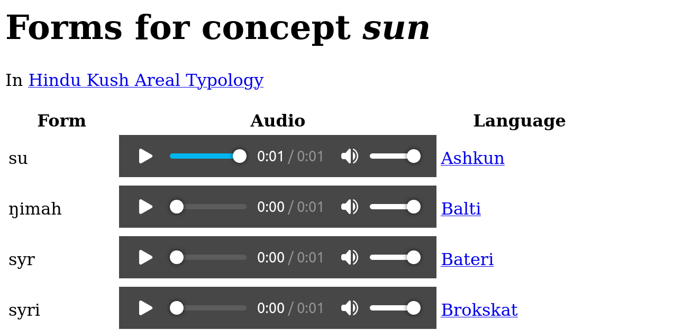

# `cldfviz.audiowordlist`

Displaying forms in a CLDF Wordlist for a specified concept together with the audio as HTML page can be done running
`cldfviz.audiowordlist`, e.g. to list the forms for the concept [sun](https://hindukush.clld.org/parameters/12)
in the [Hindu Kush Areal Typology database](https://hindukush.clld.org/) we'd run

```shell
$ cldfbench cldfviz.audiowordlist https://raw.githubusercontent.com/cldf-datasets/liljegrenhindukush/v1.1/cldf/cldf-metadata.json "Name=sun"
```

to create an HTML page looking as follows

> 

which can easily be modified/customized either after creation, or by providing a custom template
using the `--template` option and adapting [the default](../src/cldfviz/templates/audiowordlist/audiowordlist.html).


## CLDF requirements

The `cldfviz.audiowordlist` command can work with a [CLDF Wordlist](https://github.com/cldf/cldf/tree/master/modules/Wordlist)
with a [MediaTable](https://github.com/cldf/cldf/tree/master/components/media). Audio files must be 
- listed in the `MediaTable` with a [media type](https://developer.mozilla.org/en-US/docs/Web/HTTP/Basics_of_HTTP/MIME_types) 
  with type `audio` as value of the [Media_Type](https://cldf.clld.org/v1.0/terms.html#mediaType) column,
- linked to forms either with a [formReference](https://cldf.clld.org/v1.0/terms.html#formReference) column in `MediaTable` or
  a [mediaReference](https://cldf.clld.org/v1.0/terms.html#mediaReference) column in `Form`
