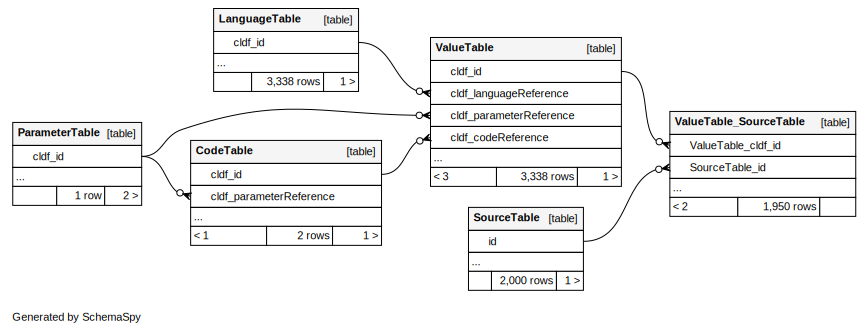

# `cldfviz.erd`

## Example

Running
```shell
$ cldfbench cldfviz.erd https://zenodo.org/record/7322688 wacl.svg --format compact.svg
```
creates



## Dependencies

In addition to the Java runtime, this command requires two jar files, which are downloaded from GitHub to a
temporary directory if not available locally. So, if you find yourself using this command often, you might want to
download these jar files yourself and point `cldfviz.erd` to their locations:

- `sqlite.jar`: https://github.com/xerial/sqlite-jdbc/releases/download/3.39.4.1/sqlite-jdbc-3.39.4.1.jar
- `schemaspy.jar`: https://github.com/schemaspy/schemaspy/releases/download/v6.1.0/schemaspy-6.1.0.jar


## Limitations

The ER diagramy created by `cldfviz.erd` do **not** reflect the dataset's schema **as literally described** in
the JSON metadata, but instead visualize the [CLDF SQL](https://github.com/cldf/cldf/blob/master/extensions/sql.md) schema.

Thus,
- table names will reflect `dc:conformsTo` rather than `url` properties of tables,
- column names will reflect `propertyUrl` rather than `name` properties of columns,
- the diagram may contain association tables, reflecting list-valued foreign keys in the JSON spec.
