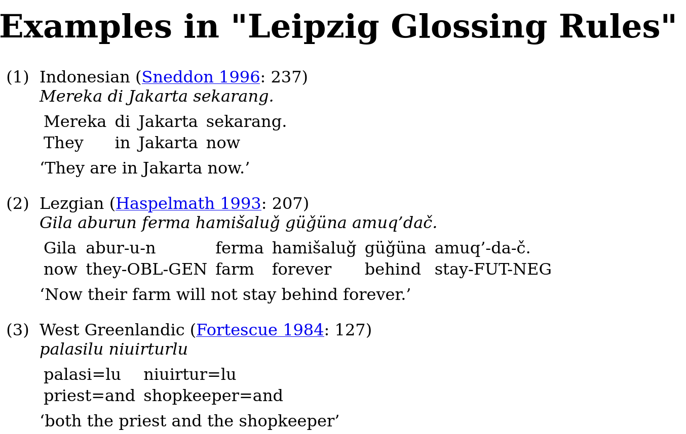

# `cldfviz.examples`

The `cldfviz.examples` command just creates an HTML page with all examples of a dataset formatted
as **I**nterlinear **G**lossed **T**ext.

So, running
```shell
$ cldfbench cldfviz.examples --output lgr.html --open https://raw.githubusercontent.com/cldf-datasets/lgr/main/cldf/Generic-metadata.json
```
should open a page in your browser looking roughly as follows:

