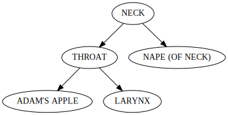
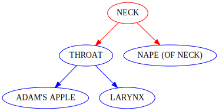

# `cldfviz.network`

The `cldfviz.network` command provides functionality to convert (filtered parts of) a dataset's
`ParameterNetwork` to formats suitable for import into network analysis programs.

While networks are a rather simple data structure - which can basically be modeled as list of edges
and serialized as tabular data - some specialized formats allow additional data e.g. to guide
visualizations. `cldfviz.network` supports conversion to two of them:
- [Graphviz' DOT format](https://graphviz.org/doc/info/lang.html)
- [GraphML](http://graphml.graphdrawing.org/)


## Example

One of the first dataset that made use of the `ParameterNetwork` component was [Concepticon]().
Concepticon contained network information for a long time (as can be seen on the landing page https://concepticon.clld.org/), 
in the form of a set of relations defined
for [concept sets](https://concepticon.clld.org/parameters). More recently, concept list have been added
to Concepticon, which contained network information as well, e.g. [Urban 2011](https://concepticon.clld.org/contributions/Urban-2011-160)
reports patterns of semantic change.

In the following we'll explore how `cldfviz.network` can be used to filter relevant parts of all the
network information in Concepticon. We'll assume an unzipped download of [DOI 10.5281/zenodo.10838527](https://doi.org/10.5281/zenodo.10838527)
is locally available at `concepticon-concepticon-cldf-2aa2c26`.

Without any filtering, `cldfviz.network` will just format the whole network information as one long
DOT `digraph` with 90386 edges:
```shell
$ cldfbench cldfviz.network concepticon-concepticon-cldf-2aa2c26/cldf/Wordlist-metadata.json | grep "\->" | wc -l
90386
```

The Concepticon dataset uses the `Description` column in `ParameterNetwork` to distinguish separate networks:
```shell
$ csvcut -c Description concepticon-concepticon-cldf-2aa2c26/cldf/parameter_network.csv | sort | uniq
antonymof
broader
Description
hasform
haspart
instanceof
intransitiveof
isa
List-2023-1308
narrower
partof
producedby
requires
resultsin
similar
transitiveof
Urban-2011-160
Winter-2022-98
Zalizniak-2020-2590
Zalizniak-2024-4583
```

There's networks for the Concepticon relations between concept sets, and networks contained in individual
concept lists. We'll look at the network for the `partof` relation first.

```shell
$ cldfbench cldfviz.network --edge-filters '{"Description":"partof"}' concepticon-concepticon-cldf-2aa2c26/cldf/Wordlist-metadata.json | wc -l
179
```

That's still a sizeable network. Let's look at just one component of it, the one containing the node
"NECK". Node IDs in the DOT graphs are exactly the parameter IDs from the CLDF dataset, so we could
specify the component we are interested in by passing [1333](https://concepticon.clld.org/parameters/1333) as
`--parameter`:

```shell
$ cldfbench cldfviz.network --edge-filters '{"Description":"partof"}' --parameter 1333 concepticon-concepticon-cldf-2aa2c26/cldf/Wordlist-metadata.json
digraph {
"802" ["label"="ADAM'S APPLE"]
"1333" ["label"="NECK"]
"1346" ["label"="THROAT"]
"1347" ["label"="NAPE (OF NECK)"]
"3714" ["label"="LARYNX"]
"1346" -> "802"
"1346" -> "3714"
"1333" -> "1346"
"1333" -> "1347"
}
```

A fairly small network. Let's create an SVG image for it. We can do so by piping the output of `cldfviz.network`
to the [`dot` program](https://graphviz.org/doc/info/command.html), and write the output of `dot` to a file:
```shell
$ cldfbench cldfviz.network --edge-filters '{"Description":"partof"}' --parameter 1333 concepticon-concepticon-cldf-2aa2c26/cldf/Wordlist-metadata.json | dot -Tsvg > docs/output/partof_neck1.svg
```



`dot` graphics can be customized by passing node or edge [attributes](https://graphviz.org/doc/info/attrs.html),
and `cldfviz.network` provides a mechanism to specify these. Both sets of attributes can be passed as
a bit of Python code, containing a single literal `dict` with strings as keys - the attribute names - and
values that are taken as corresponding attribute values. While this works to customize aspects of the
graphics such as [a font](https://graphviz.org/docs/attrs/fontname/), it does not work for attributes
where values should be related to properties of the objects (nodes or edges). Thus, attribute values
can also be specified in the Python `dict` as [lambda expressions](https://docs.python.org/3/tutorial/controlflow.html#lambda-expressions).

In the case of node attributes, such lambda expression must accept a single argument - a 
[`pycldf.orm.Parameter`](https://pycldf.readthedocs.io/en/latest/orm.html#pycldf.orm.Parameter) instance - for
edge attributes, a `pycldf.orm.ParameterNetworkEdge` instance will be passed in. In both cases the lambda
must return a value to be used for the attribute or `None` in which case the attribute will be omitted
for the node or edge.

As an example, let's color the node for the concept "NECK" red and all the others blue, by putting the
following code in a file `node.py`:
```python
dict(color=lambda e: 'red' if e.cldf.name == 'NECK' else 'blue')
```

We also want to color the edges starting at the "NECK" node red, and the others blue. Thus, put
```python
dict(color=lambda e: 'red' if e.related('sourceParameterReference').cldf.name == 'NECK' else 'blue')
```
in `edge.py`.

Now we can create a customized SVG graphic running
```shell
$ cldfbench cldfviz.network --node-attributes node.py --edge-attributes edge.py --edge-filters '{"Description":"partof"}' --parameter 1333 concepticon-concepticon-cldf-2aa2c26/cldf | dot -Tsvg > docs/output/partof_neck2.svg
```


