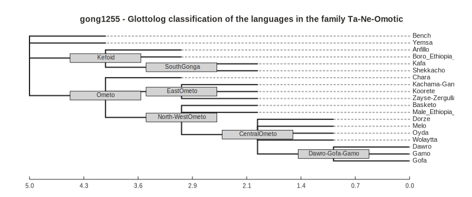
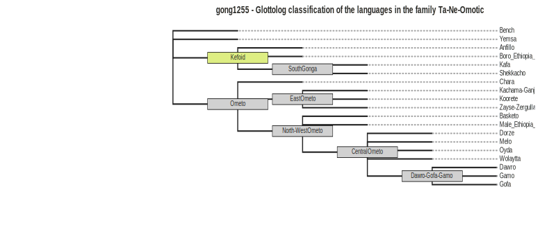
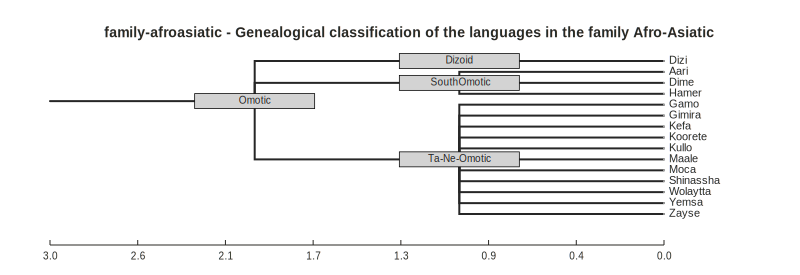

# `cldfviz.tree`

Support for [language trees](https://github.com/cldf/cldf/tree/master/components/trees) in CLDF 1.2,
established a clear visualization use case. `cldfviz.tree` meets the requirement to plot such tree structures
by wrapping the [`toytree` package](https://toytree.readthedocs.io/en/latest/index.html). It creates graphics in
[SVG format](https://de.wikipedia.org/wiki/Scalable_Vector_Graphics), which is also amenable to post-processing
using tools 

As an example, we'll plot the classification of Glottolog's [Ta-Ne-Omotic](https://glottolog.org/resource/languoid/id/gong1255)
family. This classification tree is available in [glottolog-cldf v4.7](https://github.com/glottolog/glottolog-cldf/releases/tag/v4.7)
(which we assume was downloaded and unzipped).

Now running
```shell
$ cldfbench cldfviz.tree PATH/TO/glottolog-cldf/cldf/ --tree-id  gong1255 gong1255.tree.svg --styles styles.py --name-as-label
```

with styles defined in a local file `styles.py` with the following content
```python
dict(
    width=800,
    node_labels='name',
    node_labels_style={"font-size": "10px"},
    node_markers="r10x1.25",
    node_sizes=12,
    node_style={
        "fill": "lightgrey",
        "stroke": "black",
        "stroke-width": 0.75,
    }
)
```
will create


Note that Glottolog classification trees have no meaningful branch length.

SVG can easily be manipulated (e.g. using tools such as [inkscape](https://inkscape.org/)), e.g. to change aspect ratio, 
remove the scalebar or colorize individual nodes:



We can also use `cldfviz.tree` to compare the Glottolog classification with WALS, where Ta-Ne-Omotic is a genus within
Afro-Asiatic. WALS' Afro-Asiatic genealogy is available in [WALS Online's CLDF dataset, v2020.3](https://github.com/cldf-datasets/wals/releases/tag/v2020.3).
We use the `--language-filters` option to prune the large Afro-Asiatic tree to the relevant part for
comparison (and re-use the styles from above for consistent layout):

```shell
$ cldfbench cldfviz.tree PATH/TO/wals/cldf --tree-id  family-afroasiatic wals-omotic.svg --styles styles.py --name-as-label --language-filters '{"Subfamily":"Omotic"}'
```


