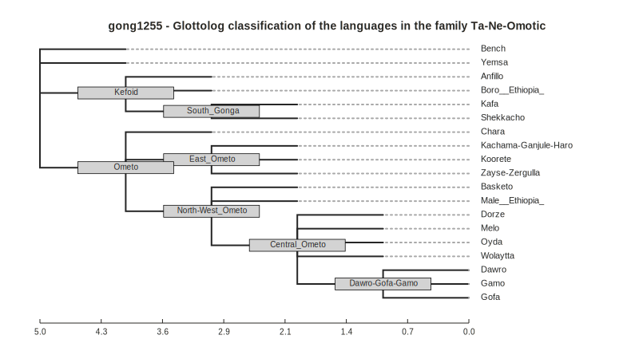

# `cldfviz.tree`

The `cldfviz.tree` command wraps functionality provided in the Python package
[`toytree`](https://toytree.readthedocs.io/en/latest/index.html) to plot (phylogenetic)
trees available in [Newick format]() in [SVG format](https://de.wikipedia.org/wiki/Scalable_Vector_Graphics)
(which is amenable to post-processing using tools like [Inkscape](https://inkscape.org/)).


## Tree specification

In the simplest case, the tree in Newick format is available as string. We can use the command's
`--ascii-art` flag for a simple check of the tree topology on the command line:
```shell
cldfbench cldfviz.tree --tree "(A:0.1,B:0.2,(C:0.3,D:0.4)E:0.5)F;" --ascii-art
    ┌─A
──F─┼─B
    │   ┌─C
    └─E─┤
        └─D
```

The SVG tree will display proper branch lenghts, of course:
```shell
cldfbench cldfviz.tree --tree "(A:0.1,B:0.2,(C:0.3,D:0.4)E:0.5)F;" --output tree.svg --open
```
> 

CLDF datasets may also contain [language trees](https://github.com/cldf/cldf/tree/master/components/trees).
As an example, we'll plot the classification of Glottolog's [Ta-Ne-Omotic](https://glottolog.org/resource/languoid/id/gong1255)
family. This classification tree is available in [glottolog-cldf v4.7](https://github.com/glottolog/glottolog-cldf/releases/tag/v4.7)
(which we assume was downloaded and unzipped).

```shell
cldfbench cldfviz.tree --tree-dataset glottolog-cldf-4.7/ --tree-id gong1255 \
--output tree.svg --open --width 600
```
> 

Note that Glottolog's classification trees do not contain meaningful branch lengths.


## Tree styling

We tap into `toytree`'s [styling options](https://toytree.readthedocs.io/en/latest/8-styling.html#Styling-toytree-drawings),
by allowing specification of a Python `dict` object providing keyword arguments for `toytree`'s
`draw` method. Providing Python code as argument on the commandline is somewhat fragile, so we can
just specify the path to a file containing the code.

With styles defined in a local file `styles.py` with the following content
```python
dict(
    width=800,
    node_labels='name',
    node_labels_style={"font-size": "10px"},
    node_markers="r10x1.25",
    node_sizes=12,
    node_style={
        "fill": "lightgrey",
        "stroke": "black",
        "stroke-width": 0.75,
    }
)
```
we can run
```shell
cldfbench cldfviz.tree --tree-dataset glottolog-cldf-4.7/ --tree-id gong1255 --output tree.svg \
--styles styles.py --name-as-label --open
```
> 

If the level of styling provided by `toytree` isn't sufficient, the SVG can easily be manipulated, 
e.g. to change aspect ratio, remove the scalebar or colorize individual nodes:

> 


## Plotting data on a tree

Plotting language data (such as typological features) on a map is a common way to visualize the
potential influence of geography on data. Similarly, plotting data on a genealogical tree can shed
light on the influence of genealogy.

Now, there isn't too much variation in Ta-Ne-Omotic for WALS features, so we'll switch to investigating
[vowel nasalization](https://wals.info/feature/10A) for Indo-European languages:
```shell
cldfbench cldfviz.tree --tree-dataset glottolog-cldf-4.7/ --tree-id indo1319 \
--data-dataset wals-2020.3/ --parameters 10A --output tree.svg \
--tree-label-property Glottocode --name-as-label --open
```
> 

Notes:
- We specified a second CLDF dataset to lookup the data with `--data-dataset`.
- To make sure that Glottocodes are used to match WALS languages to tree labels we specified
  `--tree-label-property Glottocode`.
- The `--name-as-label` flag now will use language names from the "data dataset".
- The tree was pruned to just the languages for which WALS has data on the selected feature.

As with [`cldfviz.map`](map.md), you can also choose multiple parameters:
```shell
cldfbench cldfviz.tree --tree-dataset glottolog-cldf-4.7/ --tree-id indo1319 \
--data-dataset wals-2020.3/ --parameters 10A,11A --colormaps tol,boynton \
--output tree.svg --tree-label-property Glottocode --name-as-label --open
```
> 


## Other options

We can also use `cldfviz.tree` to compare the Glottolog classification with WALS, where Ta-Ne-Omotic is a genus within
Afro-Asiatic. WALS' Afro-Asiatic genealogy is available in [WALS Online's CLDF dataset, v2020.3](https://github.com/cldf-datasets/wals/releases/tag/v2020.3).
We use the `--language-filters` option to prune the large Afro-Asiatic tree to the relevant part for
comparison (and re-use the styles from above for consistent layout):

```shell
cldfbench cldfviz.tree --tree-dataset wals-2020.3/ --tree-id family-afroasiatic --output tree.svg \
--name-as-label --language-filters '{"Subfamily":"Omotic"}' --open
```

> 
